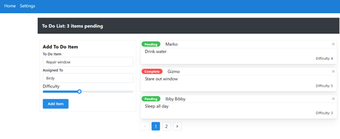
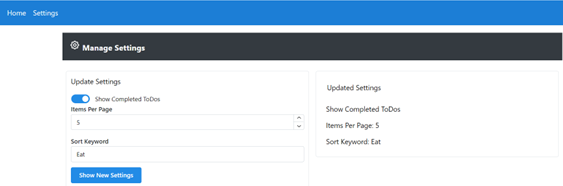
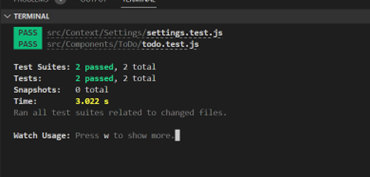

# React Context API -- Lab 32

## Author: Alan Chelko

## Problem Domain

* To Do List Manager Phase 2: Incorporate configuration settings to the application
* In this phase, we’ll be adding an editor so that users can save their preferences for the application, allowing them to change some of the default behaviors

## Requirements

* In Phase 2, we’re going to extend the functionality of our application by allowing the user to make some decisions on how they would like the application to function. Specifically, we’ll let them make changes to 2 settings.

* Implement the Context API to make some basic application settings available to components
  * How many To Do Items to show at once
  * Whether or not to show completed items
  * *Hint: If using any Mantine Input beyond TextInput, re-using the custom useForm() hook could be problematic.
* Provide the users with a form where they can change the values for those settings
  * This should be given in the form of a new component, perhaps linked to from the main navigation
  * Hint: Use Browser Router to create the page/route/component for this
  * Once settings are updated, render the updated settings to the right of the “form”. Consider using Grid, Card, and When components.
* Save the user preferences in Local Storage
* Retrieve their preferences from Local Storage and apply them to the application on startup

## Rendered ToDo App Home Page (3 items pending; 1 item complete)

## Rendered ToDo App Settings Page

## Testing

### Running the app

    * npm start 

### Running the tests

    * npm test

