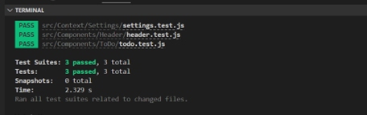

# React Context API -- Lab 31

## Author: Alan Chelko

## Problem Domain

* To Do List Manager Phase 1: Incorporate configuration settings to the application.
* Currently, a user can add todo tasks to the proof-of-life starter application. In this phase, we will add hard-wired, default context settings to the application so that the user can view three incomplete todo tasks. 
* In addition, the user will have the option of viewing any additional incomplete tasks by using pagination functionality

## Requirements

* Properly modularize the application into separate components.
* Implement the Context API to make some basic application settings available to components.
* Show three items by default.
* Hide completed items by default.
* Add the sort word ‘difficulty’ by default.
* Style the application using the Mantine Component API.

## Rendered ToDo App (3 items pending; 1 item complete)

## Testing

### Running the app

    * npm start 

### Running the tests

    * npm test

### UML: Basic Auth Server -- Lab 06 UML

